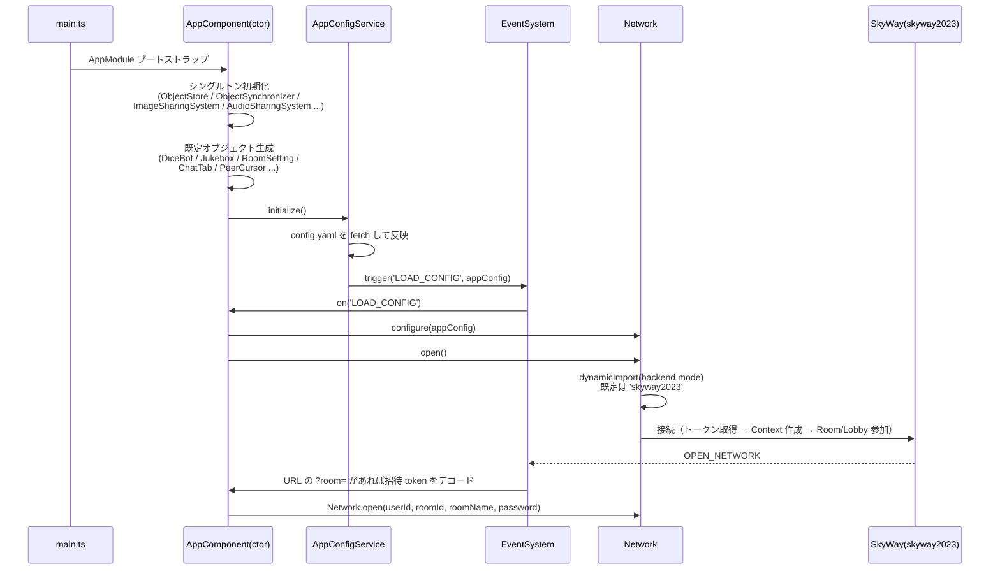
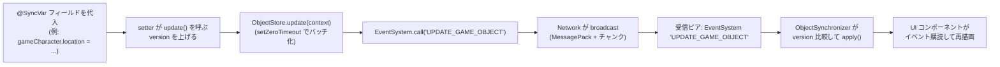

# 01. 全体アーキテクチャ

## このアプリは何か

ブラウザ上で動作する、サーバーレスのオンライン TRPG（ボードゲーム）支援ツール「ユドナリウム」を、**マーダーミステリー（マダミス）用にカスタマイズしたフォーク**です。

- 本家: [TK11235/udonarium](https://github.com/TK11235/udonarium)
- フォーク: `FukaseDaichi/udonarium_murder`

### 設計上の大原則

1. **クライアント完結 / サーバーレス**
   ゲームロジックはすべてブラウザ内で動作し、状態は WebRTC でピア同士が直接同期します。アプリ用の常設サーバーは持ちません。
2. **唯一のサーバー処理は「認証トークン発行」だけ**
   新 SkyWay（skyway2023）はブラウザから直接発行できない認証トークンを必要とするため、Netlify Functions による軽量な API（トークン発行）のみをバックエンドとして持ちます。詳細は [04-backend.md](04-backend.md)。
3. **状態は「同期オブジェクト」で表現する**
   共有したいゲーム状態はすべて `GameObject` のサブクラスにし、フィールドを書き換えるだけで全ピアへ自動複製されます。手動でネットワーク送信を書くことはほとんどありません。詳細は [02-synchronized-object-model.md](02-synchronized-object-model.md)。

## 技術スタック

| 領域 | 採用技術 |
| --- | --- |
| フレームワーク | Angular 17（単一 `NgModule`。スタンドアロンコンポーネントは未使用） |
| 言語 | TypeScript 5.2、`experimentalDecorators` 有効 |
| P2P 通信 | 新 SkyWay `@skyway-sdk/core` ^1.9.2（旧 SkyWay も動的 import でフォールバック可能） |
| バックエンド | Netlify Functions（v2、`config.path` ルーティング） |
| ダイス | BCDice（`bcdice` パッケージ） |
| PDF 閲覧 | `ng2-pdf-viewer`（フォーク固有） |
| 保存形式 | XML（オブジェクト直列化）＋ ZIP（`jszip`）。圧縮に `lzbase62` / `pako` |
| 直列化/転送 | `msgpack-lite`（ネットワーク）、`crypto-js`（ハッシュ）、`js-yaml`（設定読込） |
| テスト | Karma + Jasmine（Angular/Chrome）、Node test（Netlify Functions） |

## レイヤー構成

```
src/app/
├─ class/                     ドメイン & コア（フレームワーク非依存の純 TS）
│  ├─ core/
│  │  ├─ synchronize-object/  ← 同期オブジェクトの心臓部（02 章）
│  │  ├─ system/
│  │  │  ├─ event/            ← EventSystem（pub/sub バス、03 章）
│  │  │  ├─ network/          ← Network 抽象 + skyway / skyway2023（03 章）
│  │  │  └─ util/             ← UUID, MessagePack, 圧縮, 暗号, XML など
│  │  └─ file-storage/        ← 画像/音声の P2P 共有・保存（05 章）
│  └─ *.ts                    ← 具体ドメイン（GameCharacter, Card, ChatMessage, GamePanel ...）（07・08 章）
├─ service/                   Angular サービス（横断的関心事。06 章）
├─ component/                 Angular コンポーネント（描画と操作。06 章）
├─ directive/                 ドラッグ/回転/リサイズ等のディレクティブ（06 章）
└─ pipe/                      パイプ（safe など）

netlify/functions/            トークン発行 API（04 章）
```

依存の向きは **`component` / `service` → `class`（core・ドメイン）** が基本です。`class` 配下は Angular に依存しません（テスト容易性のため）。

## 起動シーケンス



ポイント:

- `AppComponent` の **コンストラクタが事実上のアプリ初期化処理** です（多数のシングルトンと既定オブジェクトをここで立ち上げます）。
- 設定は `index.html` の `<script type="text/yaml" src="./assets/config.yaml">` を `AppConfigService` が読み、`LOAD_CONFIG` イベントで配ります。
- ネットワークの口開けは `LOAD_CONFIG` 受信後の `Network.configure()` → `Network.open()` です。`backend.mode`（既定 `skyway2023`）に応じて接続実装が動的に選択されます。
- 参加用URL（`?room=<token>`）から起動した場合は、最初の `OPEN_NETWORK` 後に token を読み取り、同じ `roomId` / `roomName` / `password` でルームへ入り直します。

## データ同期の全体フロー

「あるピアでコマを動かす」と「全ピアに反映される」までの流れ:



- 送信側ではローカルにも同じイベントが流れ（echo）、UI が即時更新されます。
- 受信側は `ObjectSynchronizer` が**バージョンを比較して新しい場合のみ適用**します。未知オブジェクトはこの場で生成され、削除済み ID は削除通知に変換されます。
- 詳細なプロトコル（カタログ照合、欠損補完、競合解決）は [02-synchronized-object-model.md](02-synchronized-object-model.md) を参照。

## ディレクトリ早見表（主要クラス）

| 関心事 | 入口クラス/ファイル |
| --- | --- |
| 同期の核 | `core/synchronize-object/{game-object,object-store,object-synchronizer,object-serializer,decorator}.ts` |
| イベントバス | `core/system/event/event-system.ts` |
| ネットワーク | `core/system/network/{network,connection}.ts`、`network/skyway2023/*`、`network/skyway/*` |
| ファイル共有 | `core/file-storage/{image,audio}-sharing-system.ts`、`buffer-sharing-task.ts` |
| 卓上オブジェクト | `tabletop-object.ts` とその派生（`game-character.ts` ほか） |
| チャット/ダイス | `chat-message.ts`、`chat-tab-list.ts`、`dice-bot.ts` |
| フォーク固有 | `game-panel.ts`、`game-panel-selecter.ts`、`service/app-config-custom.service.ts` |
| アプリ起動 | `app.component.ts`、`app.module.ts`、`service/app-config.service.ts` |
| バックエンド | `netlify/functions/udonarium-backend.ts`、`network/skyway2023/skyway-backend.ts` |

パスエイリアス（`@udonarium/*` ほか）とコーディング規約は [conventions.md](../conventions.md) を参照してください。
