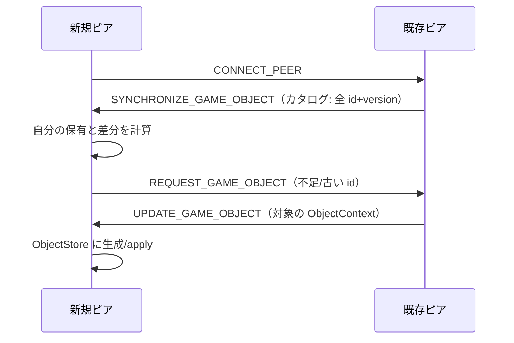

# 02. 同期オブジェクトモデル（コア）

このアプリで最も重要な抽象です。`src/app/class/core/synchronize-object/` に実装があります。

> **一言で言うと**: 共有したい状態は `GameObject` のサブクラスにし、`@SyncVar()` を付けたフィールドを代入するだけで、バージョン管理・直列化・全ピアへの複製が自動で行われる。

## 構成要素

| クラス/ファイル | 役割 |
| --- | --- |
| `GameObject`（`game-object.ts`） | すべての同期オブジェクトの基底。identity（`identifier`/`aliasName`）とバージョン付き `ObjectContext` を持つ |
| `ObjectNode`（`object-node.ts`） | `GameObject` に親子ツリーを追加。`@SyncVar` は XML **属性**として格納される |
| `@SyncObject` / `@SyncVar`（`decorator.ts` → `decorator-core.ts`） | クラス登録とフィールドの getter/setter 化（同期トリガ） |
| `ObjectFactory`（`object-factory.ts`） | `aliasName` ↔ コンストラクタの対応表。XML から実体を復元する際に使用 |
| `ObjectStore`（`object-store.ts`） | 全オブジェクトのインメモリ登録簿（シングルトン） |
| `ObjectSerializer`（`object-serializer.ts`） | オブジェクト ⇄ XML 変換。セーブ/転送のフォーマット |
| `ObjectSynchronizer`（`object-synchronizer.ts`） | ピア間のバージョン照合・差分同期（プロトコル本体） |
| `SynchronizeTask`（`synchronize-task.ts`） | 個々の同期リクエストの実行単位（TTL・タイムアウト管理） |

## GameObject と ObjectContext

```ts
interface ObjectContext {
  aliasName: string;     // 種別名（XML タグ名にもなる）
  identifier: string;    // UUID。オブジェクトの一意キー
  majorVersion: number;  // 更新のたびに +1
  minorVersion: number;  // 更新のたびに Math.random()（同 major の競合分離用）
  syncData: Object;      // 同期されるフィールドの実体
}
```

- `version = majorVersion + minorVersion`。`apply()` は **受信 version が現在より大きいときだけ** 反映するため、更新の取りこぼし/巻き戻りを抑えます。
- `toContext()` は `syncData` をディープコピーして返します（送信用スナップショット）。
- `toXml()` / `clone()` は `ObjectSerializer` 経由です。
- ライフサイクル: `initialize()` で `ObjectStore` へ登録、`destroy()` で削除。フックは `onStoreAdded()` / `onStoreRemoved()`。

## @SyncObject / @SyncVar の仕組み

`decorator.ts` は薄いラッパで、実体は `decorator-core.ts` にあります。

- `@SyncObject('alias')`
  クラスを `ObjectFactory` に `alias` で登録し、コンストラクタを差し替えて、インスタンス生成時に `applyDecorator()` を実行します。
- `@SyncVar()`
  対象が `ObjectNode` の派生かどうかで格納先が変わります。
  - 通常の `GameObject`: `context.syncData[key]` に格納
  - `ObjectNode`: `context.syncData.attributes[key]` に格納（= XML 属性になる）

`applyDecorator()` はフィールドを **getter/setter に再定義** します。

```ts
// 概念図（decorator-core.ts より）
get key()        { return this.context.syncData[key]; }
set key(value)   { this.context.syncData[key] = value; this.update(); }  // ← 代入で同期が走る
```

つまり **「フィールドへの代入」= 「バージョンアップ + 全ピアへのブロードキャスト予約」** です。これがこのアプリの中心的な仕掛けです。

> 注意: ネストしたオブジェクト/配列の **内部** を書き換えても setter は呼ばれません（`obj.location.x = 1` のように中身だけ変えても同期されない）。同期させたい場合はオブジェクトごと代入し直すか、`update()` を明示的に呼びます。

## ObjectStore（登録簿）

シングルトン。全 `GameObject` を 2 つのマップで保持します。

- `identifierMap: Map<identifier, GameObject>` — UUID 引き
- `aliasNameMap: Map<aliasName, Map<identifier, GameObject>>` — 種別引き（`getObjects('character')` 等）

主な責務:

- `add` / `remove` / `delete`（`delete` は削除履歴 `garbageMap` に記録し、`DELETE_GAME_OBJECT` を発火）
- **更新のバッチ化**: `update(context)` は `queueMap` に積み、`setZeroTimeout` で 1 ティックにまとめて `EventSystem.call('UPDATE_GAME_OBJECT')` を呼ぶ
- `getCatalog()` — 全オブジェクトの `{ identifier, version }` 一覧（同期の照合に使用）
- `isDeleted()` / `clearDeleteHistory()` — 削除済み判定（再生成を防ぐ）

## XML 直列化（ObjectSerializer）

- **タグ名 = `aliasName`**、**属性 = `syncData`（または `attributes`）** という対応です。
- ネストした値は `foo.bar.0="..."` のように **ドット区切りでフラット化** されます（`object2attributes` / `array2attributes`）。
  - コメントにもある通りこの平坦化は XML 仕様としては好ましくなく、新規設計では避けるべきパターンです。
- `parseAttributes()` には **プロトタイプ汚染ガード** があり、`__proto__` などの危険キーを含む属性はスキップします（`pollutionKey`）。
- `parseXml()` は `ObjectFactory.create(tagName)` で実体を作り、属性を流し込み、`initialize()` 後に `parseInnerXml()`（子ノード復元）を呼びます。

`ObjectNode` は `XmlAttributes` / `InnerXml` を実装し、属性と子要素（ツリー）の双方を XML に反映します。

## ObjectNode（親子ツリー）

`@SyncObject('node')`。卓上オブジェクトやデータ要素の土台です。

- `parentIdentifier`（`@SyncVar`）で親を参照。`children` は `index`（`majorIndex + minorIndex`）でソートして返す。
- 親未登録の子は `orphanNodes` に退避され、親が現れたとき接続されます（受信順序非依存）。
- `appendChild` / `prependChild` / `insertBefore` / `moveChildren` などのツリー操作を提供。
- `destroy()` は子も再帰的に破棄します。

## 同期プロトコル（ObjectSynchronizer）

`EventSystem` 上のイベントで、ピア間のオブジェクト集合を収束させます。`initialize()` で各イベントを購読します。

| イベント | 契機/処理 |
| --- | --- |
| `CONNECT_PEER` | 自分発の接続時、相手に **カタログ送信**（`sendCatalog`、2048 件ずつ） |
| `SYNCHRONIZE_GAME_OBJECT` | 受信したカタログと自分の保有を比較。古い/未保有は取得要求キューへ。削除済みは相手に削除通知 |
| `REQUEST_GAME_OBJECT` | 要求された ID の `toContext()` を相手へ `UPDATE_GAME_OBJECT` で返す |
| `UPDATE_GAME_OBJECT`（優先度 1000） | 既存なら version 比較で `apply`、未知なら生成、削除済みなら削除通知に変換 |
| `DELETE_GAME_OBJECT`（優先度 1000） | `ObjectStore.delete(id, false)`（再ブロードキャストしない） |
| `DISCONNECT_PEER` | そのピア向けの同期タスクを破棄 |

差分取得の制御:

- `requestMap`（ID→要求）と `peerMap`（ピア→実行中タスク）で管理。
- `runSynchronizeTask()` が **最も負荷の低いピアをランダム性込みで選び**（`getTargetPeerId`）、最大 32 件ずつの `SynchronizeTask` を発行。
- タスクは TTL/タイムアウトを持ち、タイムアウト時は未完リクエストを `requestMap` に戻して再試行します。



## このモデルを使うときの指針

- 新しい共有状態を足す → `@SyncObject('一意なalias')` + `@SyncVar()` フィールドのクラスを作り、`initialize()` で登録する。
- alias は **XML タグ名 = セーブ互換** に直結する。既存 alias の変更や `@SyncVar` 名のリネームは過去セーブデータを壊すので避ける（やむを得ない場合は移行を用意）。
- 高頻度更新（ドラッグ中の座標など）は setter が毎回 `update()`→ネットワーク予約を行う点に注意。`ObjectStore` 側で 1 ティックにバッチ化されるが、UI 側でも間引き（[06 章](06-ui-and-services.md) の変更検知戦略）を併用している。
