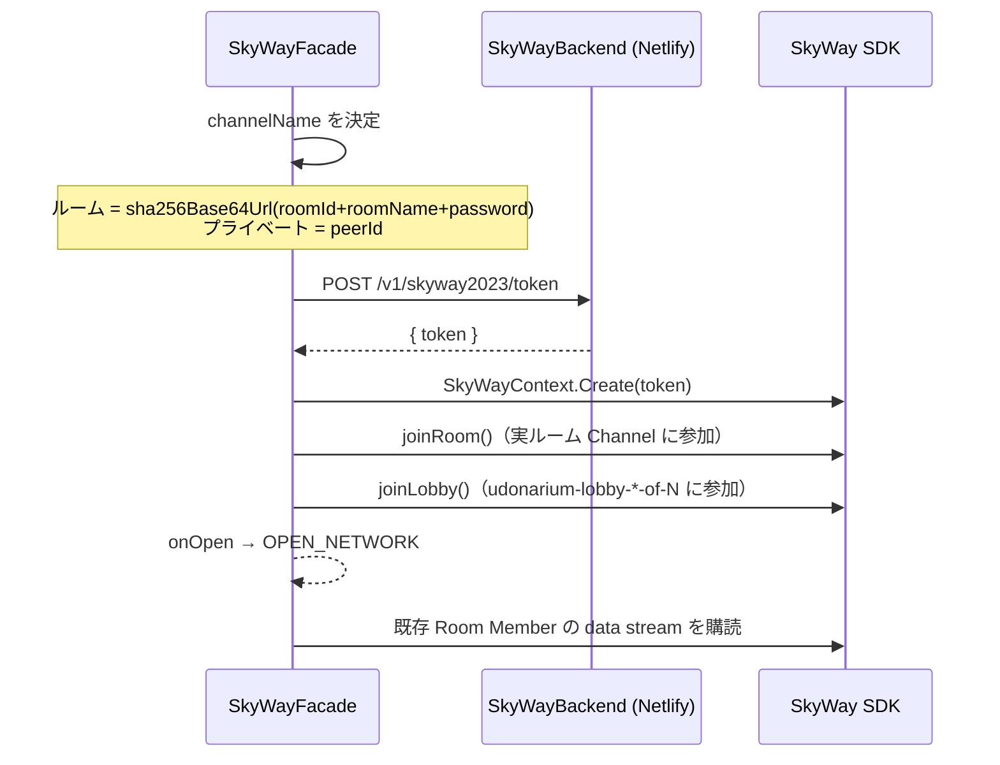

# 03. メッセージングとネットワーク

`EventSystem`（アプリ内 pub/sub）と `Network`（WebRTC/SkyWay 抽象）は、同期モデル（[02 章](02-synchronized-object-model.md)）を支える土台です。どちらも `@udonarium/core/system` から取得できるシングルトンです。

```ts
import { EventSystem, Network } from '@udonarium/core/system';
```

## EventSystem（イベントバス）

`core/system/event/event-system.ts`。ローカルの pub/sub であると同時に、**ネットワークへブリッジ** します。

### 購読と発火

```ts
EventSystem.register(this)
  .on('UPDATE_GAME_OBJECT', event => { /* ... */ })
  .on('SOME_EVENT', 1000 /* 優先度 */, event => { /* ... */ });

EventSystem.call('SOME_EVENT', data);          // ネットワークにも流す（全ピアで発火）
EventSystem.call('SOME_EVENT', data, sendTo);  // 特定ピアへ
EventSystem.trigger('SOME_EVENT', data);       // ローカルのみ（ネットワークに出さない）
EventSystem.unregister(this);                  // 購読解除（コンポーネント破棄時に必須）
```

- `register(key)` は `Listener` を返し、`key`（多くは `this`）単位でまとめて解除できます。
- リスナーは **優先度（priority）降順** で呼ばれます。`ObjectSynchronizer` の `UPDATE/DELETE_GAME_OBJECT` は優先度 1000 で、UI より先に状態を確定させます。
- イベントには `isSendFromSelf` / `sendFrom` が付き、**自分由来か他ピア由来か** を判定できます。これは無限ループ防止や UI 更新の出し分けに多用されます。

### ネットワークブリッジ

`call()` は `EventSystem` の `initializeNetworkEvent()` を通じて `Network.send()` に乗ります。受信側では同名イベントが再生されます。`trigger()` はこの経路に乗りません。

> 使い分けの目安: 全ピアで起こすべき出来事は `call`、自分のビューだけの通知は `trigger`。

## Network（通信抽象）

`core/system/network/network.ts`。シングルトン。具体的な接続実装（旧/新 SkyWay）を **動的 import** で差し替えます。

### ライフサイクル

```ts
Network.configure(appConfig);  // backend.mode / backend.url / webrtc.key などを保持
Network.open();                // openAsync: dynamicImport(mode) → Connection 生成 → open
Network.connect(peerContext);  // 既存ルームの特定ピアへ接続
Network.send(data, sendTo?);   // 送信（キューに積んでバッチ送信）
```

- `open()` は内部で `openAsync()` を呼び、`dynamicImport(this.config.backend.mode)` で接続クラスを取得します。
  - `mode === 'skyway'` → `network/skyway/skyway-connection`（旧 SkyWay）
  - `mode === 'skyway2023'`（既定）→ `network/skyway2023/skyway-connection`（新 SkyWay）
- `initializeConnection()` は選択した接続クラスを生成し、`connection.configure(this.config)` を呼び、各種コールバック（`onOpen`/`onData`/`onError` …）を中継します。

> 補足: `Network` 自体は SkyWay の世代に依存しません。世代差は `dynamicImport` と各 `Connection` 実装に閉じています。

### 送信キュー（broadcast / unicast / echocast）

`send()` は即時送信せず `queue` に積み、`setZeroTimeout` で 1 ティックにまとめて `sendQueue()` を実行します。

- `sendTo == null` → **broadcast**（全員）
- `sendTo === 自分の peerId` → **echocast**（自分自身へ。ローカル反映）
- それ以外 → **unicast**（特定ピア）

1 回のフラッシュで最大 128 件を処理し、可能な限り 1 メッセージにまとめて送ります。これにより高頻度更新でも送信回数を抑えます。

### Connection インターフェース

`core/system/network/connection.ts` が抽象境界です。旧/新 SkyWay 実装はこれを満たします。

```ts
interface Connection {
  peerId; peerIds; peer; peers; callback; bandwidthUsage;
  configure(config); open(...); close();
  connect(peer); disconnect(peer); disconnectAll();
  send(data, sendTo?);
  listAllPeers(): Promise<string[]>;
  listAllRooms(): Promise<IRoomInfo[]>;
}
```

`PeerContext`（`peer-context.ts`）はピアの識別子を表し、`isRoom`・`roomId`・`roomName`・`password` などを保持します。ルーム接続かプライベート接続かはここで区別されます。

## 新 SkyWay（skyway2023）の接続モデル

`network/skyway2023/` 配下。新 SkyWay は **Channel / Member / Publication / Subscription** モデルで、旧来の「ピア直結」とは異なります。

主要ファイル:

| ファイル | 役割 |
| --- | --- |
| `skyway-connection.ts` | `Connection` 実装。`Network` から使われる入口 |
| `skyway-facade.ts` | SkyWay SDK を直接操作する中核（Context・Room・Lobby・購読管理） |
| `skyway-backend.ts` | トークン発行 API クライアント（`/v1/status`・`/v1/skyway2023/token`） |
| `skyway-data-stream.ts` / `skyway-data-stream-list.ts` | `LocalDataStream` による送受信（チャンク・圧縮・宛先制御） |

### 接続フロー（SkyWayFacade.open）



- **チャンネル名のハッシュ化**: パスワード付きルームは `roomId + roomName + password` の SHA-256（Base64URL）を Channel 名にします。これによりパスワードを知る者だけが同じ Channel に入れます。
- **既存メンバーへの初回接続**: ルーム入室後、同じ Channel に既にいる Member の `udonarium-data-stream` Publication を購読します。招待URLや履歴復帰でロビー検索を経由しない場合でも、入室直後から同期用の DataChannel を張ります。
- **トークン自動更新**: `context.onTokenUpdateReminder` でトークン失効前にバックエンドへ再取得します（再ログイン不要）。
- **ロビー**: 新 SkyWay には旧 `Peer.listAllPeers()` 相当がないため、`udonarium-lobby-*-of-N` という共有 Channel の Member 一覧でロビー（公開ルーム一覧）を代替します。

トークンに含まれる権限・ロビー名の規約は [04-backend.md](04-backend.md) を参照してください。

## 旧 SkyWay（フォールバック）

`network/skyway/` 配下に旧実装が残っており、`backend.mode: skyway` かつ `webrtc.key` 設定時のみ動的 import されます。旧 SkyWay の Community Edition は新規登録終了済みのため、**通常は使いません**（後方互換・緊急退避用）。

## 再接続とエラーハンドリング

接続イベントとエラーは `AppComponent`（`app.component.ts`）が受けます。

- `OPEN_NETWORK`: 自分の `PeerCursor` に peerId/userId を設定。URL に `?room=<token>` があれば招待情報をデコードし、同じ `roomId` / `roomName` / `password` で `Network.open()` してルームへ入る。
- `NETWORK_ERROR`: エラー種別で出し分け。
  - `peer-unavailable` などは無視（quiet）。
  - `disconnected` / `socket-error` / `authentication` / `server-error` などは、モーダル表示後に `Network.open()` で **再接続** を試みる。
- `CONNECT_PEER`（自分発）: チャットの時刻オフセットを較正（`calibrateTimeOffset`）。

## よく使うネットワーク系イベント

| イベント | 意味 |
| --- | --- |
| `OPEN_NETWORK` | 自分の接続が開いた |
| `CONNECT_PEER` / `DISCONNECT_PEER` | ピアの接続/切断 |
| `NETWORK_ERROR` | 接続エラー（再接続判断に使用） |
| `UPDATE_GAME_OBJECT` / `DELETE_GAME_OBJECT` | オブジェクト同期（[02 章](02-synchronized-object-model.md)） |
| `SYNCHRONIZE_GAME_OBJECT` / `REQUEST_GAME_OBJECT` | カタログ照合・差分取得 |
| `SYNCHRONIZE_FILE_LIST` / `SYNCHRONIZE_AUDIO_LIST` | ファイル/音声カタログ同期（[05 章](05-file-sharing-and-save.md)） |
