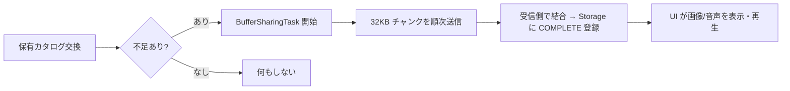

# 05. ファイル共有とセーブ/ロード

画像・音声は同期オブジェクト（XML）には載せず、**専用のチャンク共有システム** でピア間に配ります。ルーム全体は ZIP として保存/復元します。実装は `src/app/class/core/file-storage/` と `service/save-data.service.ts`。

## ストレージ（受け皿）

| クラス | 役割 |
| --- | --- |
| `ImageStorage`（`image-storage.ts`） | 画像の登録簿。`identifier`（多くは内容ハッシュ）で引く |
| `AudioStorage`（`audio-storage.ts`） | 音声の登録簿 |
| `ImageFile`（`image-file.ts`） | 画像 1 件。`state`（`NULL`/`EMPTY`/`COMPLETE` 等）、`blob`、`url`、サムネイルを持つ |
| `AudioFile`（`audio-file.ts`） | 音声 1 件。`isHidden`（プリセット音を一覧から隠す）等 |

- オブジェクト側（コマ・カード・パネル等）は **画像の実体ではなく `imageIdentifier`（参照）だけ** を `@SyncVar` で持ちます。実体は各ピアのストレージに非同期で行き渡ります。
- 起動時に既定アイコンや効果音（ダイス/カード/SE/アラーム）を `AppComponent` が `*Storage` に登録します（[01 章](01-overview.md) 起動シーケンス）。

## 共有プロトコル

### カタログ同期

`image-sharing-system.ts` / `audio-sharing-system.ts` が、接続時やリスト変更時に **保有ファイルのカタログ**（identifier の一覧と状態）を交換します（`SYNCHRONIZE_FILE_LIST` / `SYNCHRONIZE_AUDIO_LIST`）。不足しているファイルを見つけたピアが転送タスクを開始します。考え方はオブジェクト同期（[02 章](02-synchronized-object-model.md)）と同じ「カタログ照合 → 差分要求」です。

### チャンク転送（BufferSharingTask）

`buffer-sharing-task.ts` が実体（バイナリ）の送受信を担います。

- データを **32KB のチャンク** に分割（`chankSize = 32 * 1024`）。
- `bufferingChankRange`（既定 4）で先読み的に複数チャンクを流す（フロー制御）。
- 各チャンクは `MessagePack` で直列化して送る。
- `ResettableTimeout` で受信が途切れたタスクをタイムアウト。`onprogress` / `onfinish` / `ontimeout` / `oncancel` のコールバックで進捗管理。
- 送信タスク（`createSendTask`）と受信タスク（`createReceiveTask`）が対になって 1 ファイルを転送します。

補助ユーティリティ:

- `canvas-util.ts` — サムネイル生成や画像加工。
- `file-reader-util.ts` / `base64.ts` / `mime-type.ts` — 読み込み・エンコード・MIME 判定。
- `core/system/util/compress.ts`（`lzbase62` / `pako`）— 圧縮。

## ルームのセーブ/ロード

### セーブ（`SaveDataService.saveRoomAsync`）

ルーム全体を 1 つの ZIP にまとめます。

1. 次の XML を生成（`ObjectSerializer` + `vkbeautify` で整形）:
   - `data.xml` … `Room`（卓上オブジェクト一式の集約ルート）
   - `chat.xml` … `ChatTabList`
   - `summary.xml` … `DataSummarySetting`（インベントリ表示設定）
2. XML 内で参照される画像（`type="image"` / `imageIdentifier` / `backgroundImageIdentifier`）を走査し、`COMPLETE` な `ImageFile` の blob をファイル化して同梱（`searchImageFiles`）。
3. `FileArchiver`（`jszip`）で ZIP 化し、`<名前>_YYYY-MM-DD_hhmm` 形式のファイル名でダウンロード。

- 処理は `PromiseQueue` で直列化され、保存の多重実行を防ぎます。
- 進捗は `updateCallback(percent)` で UI（`AppComponent.progresPercent`）に返ります。
- `saveGameObjectAsync` は単一オブジェクト（コマやカード等）だけを XML+画像で書き出します。

### ロード（`FileArchiver.load`）

ファイル/フォルダのドロップやファイル選択を受け、ZIP・XML・画像・音声を判別して取り込みます。

- 画像/音声は `ImageStorage` / `AudioStorage` へ。
- XML は `ObjectSerializer.parseXml` で同期オブジェクトに復元し、`ObjectStore` に登録（= 接続中の全ピアにも同期）。

> セーブデータ互換は **XML タグ名（`aliasName`）と属性名（`@SyncVar` 名）** に依存します。これらを変更すると過去データを読めなくなります（[02 章](02-synchronized-object-model.md) の指針参照）。
