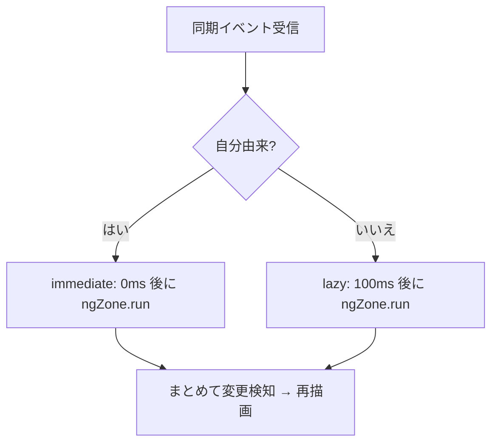

# 06. UI 層（コンポーネントとサービス）

UI は Angular 17 の **単一 `NgModule`**（`app.module.ts`、スタンドアロン未使用）で構成します。コンポーネントは同期オブジェクトを描画・操作し、`EventSystem` を購読して再描画します。

## 役割分担

- **`component/`** … 画面要素。各 `TabletopObject` に対応する描画（`game-character`, `card`, `terrain` …）、チャット、パネル、モーダル、ロビーなど。
- **`service/`** … 横断的関心事（後述）。
- **`directive/`** … 卓上での操作（ドラッグ/回転/リサイズ）と選択同期。
- **`pipe/`** … `safe.pipe`（`DomSanitizer` ラップ）など。

依存方向は `component` → `service` → `class`（ドメイン/コア）。コンポーネントはドメインのメソッドを呼び、状態変更は同期モデル経由で他ピアに伝わります。

## 主要サービス

| サービス | 役割 |
| --- | --- |
| `AppConfigService` | `config.yaml` 読込と `LOAD_CONFIG` 発火、ピア履歴 |
| `AppConfigCustomService` | **フォーク固有**。GM/ビューアモード状態（`isViewer$` / `dataViewer`）。[08 章](08-murder-mystery-extensions.md) |
| `TabletopService` | 卓上オブジェクトのキャッシュと取得、テーブル状態 |
| `TabletopActionService` | 卓上の右クリックアクション（コマ/カード/地形などの生成・操作） |
| `TabletopSelectionService` | 複数選択の管理 |
| `GameObjectInventoryService` | インベントリ（一覧パネル）のデータ整形 |
| `ChatMessageService` | チャット送信、時刻オフセット較正（`calibrateTimeOffset`） |
| `SaveDataService` | ルーム/オブジェクトの ZIP セーブ（[05 章](05-file-sharing-and-save.md)） |
| `ImageService` | 画像選択補助 |
| `PanelService` / `ModalService` / `ContextMenuService` | 動的コンポーネントによるウィンドウ/モーダル/右クリックメニュー |
| `PointerDeviceService` / `CoordinateService` | ポインタ座標・座標変換 |
| `BatchService` | バッチ処理ユーティリティ |

## パネル/モーダルの仕組み

`PanelService` 等は **`ViewContainerRef` に動的にコンポーネントを生成** してウィンドウ化します。

- `AppComponent.ngAfterViewInit` で `modalLayer`（`ViewContainerRef`）を各サービスの `defaultParentViewContainerRef` に設定。
- 実体クラスは外部から注入されます（`PanelService.UIPanelComponentClass = UIPanelComponent` など、`app.component.ts` 末尾）。これにより `service`（下層）が `component`（上層）へ直接依存せずに済みます。
- `AppComponent.open(name)` がパネル種別ごとの初期サイズ/位置を決めて開きます。

## 変更検知戦略（重要）

高頻度の同期更新で Angular の変更検知が暴発しないよう、**ゾーン外で動かし手動で間引き** ます。

- `AppComponent` コンストラクタの初期化は `ngZone.runOutsideAngular(...)` 内で実行（不要な検知を避ける）。
- 同期イベント（`UPDATE_GAME_OBJECT` / `DELETE_GAME_OBJECT` / `UPDATE_SELECTION` …）受信時は `lazyNgZoneUpdate(isImmediate)` を呼ぶ。
  - 自分由来（`isSendFromSelf`）は **即時**（`immediateUpdateTimer`、0ms）。
  - 他ピア由来は **遅延**（`lazyUpdateTimer`、100ms）でまとめて 1 回 `ngZone.run(() => {})` を実行し、再描画を誘発。
  - 2 つのタイマーは相互に打ち消し合い、過剰な検知を防ぎます。

各コンポーネントは `EventSystem.register(this).on(...)` で購読し、`ngOnDestroy` で `EventSystem.unregister(this)` を必ず呼びます（リーク防止）。

## ディレクティブ（卓上操作）

- `MovableDirective` / `RotableDirective` / `ResizableDirective` / `DraggableDirective` … 卓上ピースの移動・回転・リサイズ。
- `movable-selection-synchronizer.ts` / `rotable-selection-synchronizer.ts` … 複数選択時に操作を選択オブジェクト群へ伝播。
- `TooltipDirective` … ツールチップ。
- ジェスチャは `component/game-table/` 配下（`table-mouse-gesture` / `table-touch-gesture` / `table-pick-gesture`）でマウス/タッチを抽象化。

## モバイル対応の補足

`app.component.ts` 末尾の `workaroundForMobileSafari()` は、iOS Safari で CSS アニメーションに悪影響する `transform-style` を上書き修正します。
