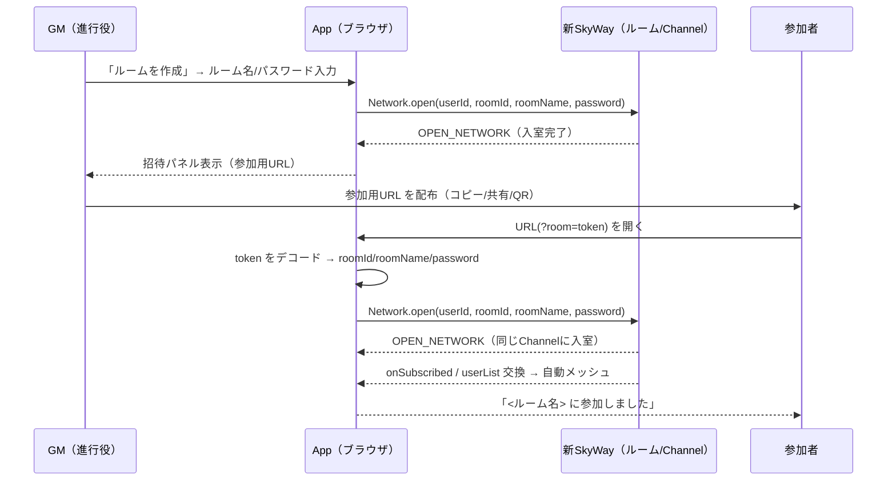

# ルーム招待URL機能 設計書 — GMのルーム作成と「参加用URL」配布UX

> 種別: **機能設計（提案）**。本書は未実装の機能設計です。現行コードの設計は [architecture/01-overview.md](architecture/01-overview.md) を参照してください。
> 関連: [03-messaging-and-network.md](architecture/03-messaging-and-network.md) / [08-murder-mystery-extensions.md](architecture/08-murder-mystery-extensions.md)

## 1. 背景 / アップデート情報

### 1.1 新SkyWay対応で「接続」が復活した

旧 SkyWay（Community Edition）は新規登録・運用が終了し、**ピア同士がつながらない状態**になっていました。本フォークは新 SkyWay(`skyway2023`)へ移行済みで（[03 章](architecture/03-messaging-and-network.md)）、**接続機能が復活**しています。この事実は利用者向けにアプリ内（チャットタブの「アップデート」フィード）で告知します（[§3](#3-アップデート告知-chat-tabcomponentts)）。

### 1.2 旧「接続URL取得」が新SkyWayでは機能しない

旧来の「接続URL取得」ボタン（[peer-menu.component.html:13](../src/app/component/peer-menu/peer-menu.component.html)）は、`?id=<userId>` 形式のURLを生成し、受信側（[app.component.ts:216-225](../src/app/app.component.ts)）で **プライベート（直接ピア）接続** を試みる仕組みでした。

しかし新 SkyWay では **プライベート接続そのものが利用不可** です。接続実装が明示的に拒否します。

```ts
// src/app/class/core/system/network/skyway2023/skyway-connection.ts:71-78
connect(peer: IPeerContext): boolean {
  if (!this.peer.isRoom) {
    // 'SkyWay(2023)を使用する場合、プライベート接続は利用できません。ルーム接続機能を利用してください。'
    return false;
  }
  ...
}
```

UI 側でも `canUsePrivateSession` は旧モード限定です（[peer-menu.component.ts:102-104](../src/app/component/peer-menu/peer-menu.component.ts)）。

```ts
get canUsePrivateSession(): boolean {
  return this.config.backend.mode === 'skyway'; // skyway2023 では false
}
```

つまり旧「接続URL取得」は **既定（skyway2023）では URL を生成しても誰もつながらない＝事実上削除済み** です。

### 1.3 本設計のゴール

新 SkyWay の **ルーム接続** を前提に、**マスター（GM）が部屋を作り、参加者に「開くだけで入れる」専用URLを配布できる**、わかりやすい UX を提供します。

## 2. ゴール / 非ゴール

**ゴール**

- GM がアプリ起動後に迷わず **ルームを作成** できる導線。
- ルーム作成後に **参加用URL** を 1 クリックでコピー／共有できる、明快な招待UI。
- 参加者がURLを **開くだけで自動入室** できる（手動のID交換・ロビー検索が不要）。
- 新SkyWay対応の事実をアプリ内で告知。

**非ゴール**

- 旧 SkyWay（`backend.mode: skyway`）のプライベート接続UXの拡張（後方互換は最小限）。
- 認証基盤・アカウント・サーバー側のルーム管理（本アプリはサーバーレス P2P を維持）。
- ロビー（公開ルーム一覧）機能の置き換え。招待URLは **ロビーへの追加導線** であり、ロビーは残します。

## 3. アップデート告知（chat-tab.component.ts）

アプリ内告知は `ChatTabComponent.sampleMessages`（[chat-tab.component.ts:44-113](../src/app/component/chat-tab/chat-tab.component.ts)）の末尾に **新規エントリを追記** します。

- 既存の旧告知「接続URL取得機能を追加しました…」（[chat-tab.component.ts:61](../src/app/component/chat-tab/chat-tab.component.ts)）は **履歴として残します**（このフィードは時系列の更新履歴のため）。新エントリで実質的に上書き告知します。
- タイムスタンプは実装日（例: `2026-06-25` 相当 `1782345600000`。実装時に `Date.UTC(...)` 等で確定）。

追記する内容（文言は実装時に微調整可）:

```ts
this.makeSampleMessage(
  'System', null, 'アップデート',
  '新しいSkyWayに対応しました。旧SkyWayの終了で接続できなくなっていた問題を解消し、ルームでの接続が復活しています。',
  /* timestamp */ 1782345600000
),
this.makeSampleMessage(
  'System', null, 'アップデート',
  'マスター（GM）がルームを作成すると「参加用URL」を配布できるようになりました。参加者はURLを開くだけで自動で同じ部屋に入れます。（旧「接続URL取得」は本機能に置き換わりました）',
  /* timestamp */ 1782345600000
),
```

## 4. 設計概要（全体像）



**重要な前提（コード根拠）**: 同じ `roomId/roomName/password` で `Network.open()` すると、Channel名 = `sha256(roomId+roomName+password)` が一致し **同じ部屋に入ります**。入室後のピア接続は SkyWay の購読コールバックとユーザーリスト交換で **自動的にメッシュ化** されるため、参加者側で明示的な `Network.connect()` は不要です。

- 自動購読: [skyway-connection.ts:215-225](../src/app/class/core/system/network/skyway2023/skyway-connection.ts)（`onSubscribed` → `connectStream`）
- 未知ピアへの自動接続: [skyway-connection.ts:334-341](../src/app/class/core/system/network/skyway2023/skyway-connection.ts)（`onUpdateUserIds`）

## 5. 招待URLスキーム

### 5.1 採用案: 単一トークン `?room=<token>`

参加に必要なのは `roomId` / `roomName` / `password`（平文）です。GM 側の `Network.peer` は作成時に **平文パスワードを保持** しています（[peer-context.ts:118-128](../src/app/class/core/system/network/peer-context.ts) の `_createRoom` で `peer.password = password`）。これを 1 つのトークンにまとめます。

```ts
// 例: src/app/class/core/system/network/room-invite.ts（新規）
import * as lzbase62 from 'lzbase62';

export interface RoomInvitePayload {
  r: string; // roomId
  n: string; // roomName
  p: string; // password（平文・空文字可）
}

export function encodeRoomInvite(p: RoomInvitePayload): string {
  return lzbase62.compress(JSON.stringify(p));
}

export function decodeRoomInvite(token: string): RoomInvitePayload | null {
  try {
    const o = JSON.parse(lzbase62.decompress(token));
    if (typeof o?.r !== 'string' || typeof o?.n !== 'string' || typeof o?.p !== 'string') return null;
    return o;
  } catch {
    return null;
  }
}

export function buildRoomInviteUrl(p: RoomInvitePayload, base = window.location.href): string {
  const url = new URL(base);
  url.search = '';                                  // 既存パラメータを除去
  url.searchParams.set('room', encodeRoomInvite(p)); // room トークンのみ付与
  return url.href;
}
```

- **`lzbase62` を採用**: 既に依存に含まれ（peer-context が roomName 圧縮に使用＝日本語を含む文字列で実績あり）、出力は URL セーフな base62。`encodeURIComponent` 不要で短い。
- パスワードは内包（ワンクリック入室）。トークン化は **難読化と短縮が目的でセキュリティ目的ではない**（[§9 セキュリティ](#9-セキュリティ考慮)）。

### 5.2 不採用案

| 案 | 不採用理由 |
| --- | --- |
| 複数生パラメータ `?roomId=..&roomName=..&password=..` | パスワードがアドレスバーに丸見え。URL が冗長。 |
| ルーム peerId をそのまま載せる | peerId は **パスワードのダイジェスト** しか持たず（[peer-context.ts:145-148](../src/app/class/core/system/network/peer-context.ts)）、平文が無いと Channel ハッシュを計算できず保護付き部屋へ入室不可。 |

## 6. 参加者の自動入室（app.component）

現行の `?id=`（プライベート接続）ロジック（[app.component.ts:216-225](../src/app/app.component.ts)）を **`?room=` のルーム自動入室に置き換え** ます。

```ts
.on('OPEN_NETWORK', (event) => {
  PeerCursor.myCursor.peerId = Network.peer.peerId;
  PeerCursor.myCursor.userId = Network.peer.userId;

  const url = new URL(window.location.href);
  const token = url.searchParams.get('room');
  if (!token) return;

  // ① ループ防止 & アドレスバーからパスワードを消す（後述）
  url.searchParams.delete('room');
  history.replaceState(null, '', url.href);

  const invite = decodeRoomInvite(token);
  if (!invite) {
    // ② デコード失敗 → エラー表示（§8）
    EventSystem.trigger('ROOM_INVITE_INVALID', {});
    return;
  }

  // ③ 既に同じ部屋にいるなら何もしない
  if (Network.peer.isRoom && Network.peer.roomId === invite.r) return;

  // ④ 別の部屋にいる場合は確認（§8）。未入室なら即入室。
  this.joinRoomFromInvite(invite);
})
```

```ts
private joinRoomFromInvite(invite: RoomInvitePayload) {
  const userId = Network.peer.userId;          // 既存 userId を引き継ぐ
  ObjectStore.instance.clearDeleteHistory();   // lobby と同じ前処理
  Network.open(userId, invite.r, invite.n, invite.p);
  PeerCursor.myCursor.peerId = Network.peerId;
  EventSystem.trigger('ROOM_INVITE_JOINING', { roomName: invite.n }); // 「参加中…」UX
}
```

**ループ防止が必須**: `Network.open()` は新たな `OPEN_NETWORK` を発火します。先に `?room=` を URL から除去（`history.replaceState`）しておくことで、2 回目の `OPEN_NETWORK` では `token` が無く早期 return し、再入室ループを防ぎます。**副次効果としてアドレスバーから合言葉付き URL が消える**（入室後に画面共有してもパスワードが露出しない）ため、UX/安全性の両面で有効です。

**後方互換（任意）**: どうしても旧 `?id=` を残す場合は `config.backend.mode === 'skyway'`（旧モード）に限定したフォールバックとして実装します。既定運用では不要のため、本設計では **削除を推奨** します。

## 7. UI 設計（本機能の主役）

### 7.1 設計原則

1. **役割を最初に明示する** — 起動直後の利用者は「作る側／入る側」が分からない。最初の画面で二者択一を明確に。
2. **配布を一瞬で** — 作成直後に参加用URLを最前面に。大きなコピーボタン＋共有＋（QR）。
3. **参加は摩擦ゼロ** — URLを開く→自動入室→明確な状態表示。手動操作を挟まない。
4. **常にフィードバック** — コピー完了、参加人数、参加中／エラーを言葉で返す。
5. **安全をそっと伝える** — URLは「部屋の鍵」。公開貼り付けへの注意を控えめに表示。
6. **段階的開示** — 状態（未入室／入室済／参加中）に応じて必要なものだけ出す。
7. **モバイル前提** — 対面マダミスではスマホ参加が多い。共有/QR・タップしやすい大きさ・縦積み。

### 7.2 状態モデル

接続情報パネル（`PeerMenuComponent`）を状態で出し分けます。

| 状態 | 条件 | 主な表示 |
| --- | --- | --- |
| **A. 未入室** | `!Network.peer.isRoom` | 役割導線（GM=作成 / 参加者=参加） |
| **B. 入室済** | `Network.peer.isRoom` | 招待パネル（参加用URL／コピー・共有・QR／部屋情報／参加状況） |
| **C. 参加中** | `?room=` から入室処理中 | 「<ルーム名> に参加しています…」オーバーレイ → 成功トースト／エラー |

### 7.3 状態A: 未入室（役割導線）

```
┌─────────────────────────────────────────┐
│ ニックネーム / アイコン（既存・上部に簡潔に）      │
├─────────────────────────────────────────┤
│  ▶ マスター（GM）として始める                    │
│    あなたが進行役です。部屋を作成して、           │
│    参加者に参加用URLを配ります。                  │
│            [  ルームを作成  ]   ← 主ボタン        │
│                                          │
│  ▶ 参加者として参加する                          │
│    進行役から届いた参加用URLを開くと、            │
│    自動でこの部屋に入れます。                     │
│    URLが無い場合はロビーから探せます。            │
│            [  ロビーを開く  ]   ← 副ボタン        │
└─────────────────────────────────────────┘
```

- 「ルームを作成」は `RoomSettingComponent` を **直接** 開く（現状はロビー経由でしか辿れない導線を短縮）。
- 「ロビーを開く」は既存 `LobbyComponent`。
- 視覚階層: GM 側を主アクション（塗りボタン）、参加者側を副アクション（枠線ボタン）。

### 7.4 状態B: 入室済（招待パネル）

```
┌─────────────────────────────────────────┐
│  参加者を招待                                    │
│  ┌─────────────────────────────────┐  │
│  │ https://….app/?room=Xa9…            │ ← 読取専用 │
│  └─────────────────────────────────┘  │
│   [ リンクをコピー ]  [ 共有 ]  [ QRコード ]      │
│                                          │
│   このURLを参加者に配ってください。               │
│   開くだけで自動でこの部屋に参加します。           │
│   🔑 URLには合言葉（パスワード）が含まれます。      │
│      部屋の鍵と同じです。公開の場所に貼らないで。   │
│                                          │
│   現在 2 人が参加しています。                     │
├─────────────────────────────────────────┤
│  ルーム名: ○○ / ○○○    パスワード: ●●●● [👁]    │
└─────────────────────────────────────────┘
```

- **参加用URL**: 読取専用テキスト。クリック/タップで全選択。長い場合は省略表示（実体は完全URL）。
- **[リンクをコピー]**: 主ボタン。押下で `navigator.clipboard.writeText`、ボタンが「コピーしました ✓」へ約2秒変化＋ `aria-live` で読み上げ。失敗時は手動選択を促す。
- **[共有]**: `navigator.share` が使える環境のみ表示（モバイルで強力）。`{ title, text, url }` を渡す。
- **[QRコード]**: トグルで QR を表示（対面参加でスマホがすぐ入れる。[§10 拡張](#10-段階導入--今後の拡張) で依存判断）。
- **参加状況**: `Network.peers.length` を文言化。0 人なら「まだ誰も参加していません。上のURLを配って参加者を待ちましょう。」
- **部屋情報**: ルーム名／パスワード（表示/非表示トグルは既存を踏襲）。
- 旧「接続URL取得」ボタンは **撤去**。

### 7.5 作成直後フロー（RoomSetting の完了ステップ）

「作る→すぐ配る」を 1 画面で完結させると最良です。`RoomSettingComponent` に **完了ステップ** を追加します。

```
[ 設定 ]                         [ 作成完了 ]
ルーム名 [______]      →作成→     ✓ 「○○」を作成しました
パスワード [______]               参加用URL [______________]
[ 作成 ]                          [ リンクをコピー ] [ 共有 ]
                                  この URL を参加者に配布してください
                                  [ 閉じてテーブルへ ]
```

- 作成成功（`createRoom()` 後）にモーダルを閉じず、同じモーダル内で URL を提示。
- 永続的な再コピー場所は状態B（接続情報パネル）。完了ステップは「作成直後の即時導線」。

### 7.6 状態C: 参加中／結果表示

- **参加中**: 中央オーバーレイ＋スピナー「「<ルーム名>」に参加しています…」。
- **成功**: オーバーレイを閉じ、トースト「「<ルーム名>」に参加しました」。
- **デコード不正**（`ROOM_INVITE_INVALID`）: 「参加用URLが正しくありません。URLをもう一度確認してください。」＋[ロビーを開く]。
- **進行役が不在の可能性**: 入室後 N 秒（例 10 秒）ピアが 0 のままなら控えめなヒント「進行役（GM）がまだ部屋にいないようです。少し待つか、URLを確認してください。」（ハードエラーにしない＝[§8](#8-エッジケース--エラーハンドリング) 参照）。
- **別の部屋に移動の確認**: 既に別ルームにいる状態でURLを開いたら確認「別の部屋『<ルーム名>』に移動しますか？現在の部屋からは退出します。」[移動する]/[キャンセル]。

### 7.7 マイクロコピー一覧（実装の素材）

| 箇所 | 文言 |
| --- | --- |
| GM導線・見出し | マスター（GM）として始める |
| GM導線・説明 | あなたが進行役です。部屋を作成して、参加者に参加用URLを配ります。 |
| GMボタン | ルームを作成 |
| 参加者導線・見出し | 参加者として参加する |
| 参加者導線・説明 | 進行役から届いた参加用URLを開くと、自動でこの部屋に入れます。URLが無い場合はロビーから探せます。 |
| 招待見出し | 参加者を招待 |
| 招待説明 | このURLを参加者に配ってください。開くだけで自動でこの部屋に参加します。 |
| コピー（前/後） | リンクをコピー → コピーしました ✓ |
| 安全注意 | 🔑 URLには合言葉（パスワード）が含まれます。部屋の鍵と同じです。公開の場所には貼らないでください。 |
| 参加状況（0/n） | まだ誰も参加していません。上のURLを配って参加者を待ちましょう。 / 現在 {n} 人が参加しています。 |
| 参加中 | 「{roomName}」に参加しています… |
| 参加成功 | 「{roomName}」に参加しました |
| URL不正 | 参加用URLが正しくありません。URLをもう一度確認してください。 |
| 移動確認 | 別の部屋「{roomName}」に移動しますか？現在の部屋からは退出します。 |

### 7.8 アクセシビリティ / レスポンシブ

- URL入力に `aria-label="参加用URL"`、コピー結果は `aria-live="polite"` で通知。
- すべてのアクションはキーボード到達可能、フォーカスリング維持、十分なコントラスト。
- 招待パネル表示時に URL フィールドへフォーカスし全選択（手動コピーの保険）。
- narrow 幅ではボタンを縦積み・全幅化。QR は最大 ~220px。

## 8. エッジケース / エラーハンドリング

| ケース | 挙動 |
| --- | --- |
| `?room=` のデコード失敗 | 入室せず URL不正メッセージ。アドレスバーは既に浄化済み。 |
| 既に同じ部屋にいる | 何もしない（早期 return）。 |
| 既に別の部屋にいる | 移動確認モーダル。OK で退出→新ルーム入室。 |
| 部屋に誰もいない/合言葉不一致 | **ハードエラーにしない**。新SkyWayは「部屋が無い」を即時に返さず、入室すると自分が唯一のメンバーになる。合言葉違いは別Channelに入るだけ。→ 状態C「進行役が不在の可能性」ヒントで吸収。 |
| 再接続（NETWORK_ERROR→Network.open） | 既存の再接続（[app.component.ts:227-249](../src/app/app.component.ts)）と `peerHistory` 復帰（[peer-menu.component.ts:197-247](../src/app/component/peer-menu/peer-menu.component.ts)）はルーム情報を保持するため整合。`?room=` は入室時に消すので再処理されない。 |
| URLが長い | `roomName`/`password` が長いと URL も伸びる。room 作成時の `peerId<64` 制約（[room-setting.component.ts:42-46](../src/app/component/room-setting/room-setting.component.ts)）は維持。トークン長は実用上問題ない範囲。 |
| クリップボード不可（権限/古い環境） | コピー失敗時は URL を全選択して「手動でコピーしてください」を表示。 |

## 9. セキュリティ考慮

- **合言葉を内包する=URLは部屋の鍵**: URL を知る者は誰でも入室可能。UI で明示し（§7.4 安全注意）、入室後はアドレスバーから即除去（§6）。
- **トークンは難読化であって暗号化ではない**: `lzbase62` は復元可能。秘匿性は「URLを限られた相手にだけ渡す」運用に依存。これは本アプリのサーバーレス P2P モデル（ロビー/ルームのパスワード設計と同等）と整合。
- **`?room=` 自動入室の安全弁**: 入室は `roomId/roomName/password` のみで実行し、外部から任意コード実行等は不可能。デコードは try/catch で失敗を無害化。
- 既存の `verifyPeer`/`verifyPassword`（[peer-context.ts:65-94](../src/app/class/core/system/network/peer-context.ts)）と Channel ハッシュにより、合言葉不一致のピアは同じ部屋に到達できない。

## 10. 段階導入 / 今後の拡張

実装は段階分割を推奨します。

1. **フェーズ1（最小で動く）**: `room-invite.ts`（エンコード/デコード）＋ `app.component` の `?room=` 自動入室 ＋ chat-tab 告知。これだけで「URLを配れば入れる」が成立。
2. **フェーズ2（UX刷新）**: `PeerMenuComponent` の状態A/B（役割導線・招待パネル・コピー/共有）と旧ボタン撤去。
3. **フェーズ3（磨き込み）**: `RoomSetting` 完了ステップ、状態C（参加中/エラー/移動確認）、参加人数表示、QRコード。

**QRコードの依存判断**: 対面マダミスでの体験価値は高い。インラインSVGで描く軽量QR生成（小さなユーティリティ）か、`qrcode` 等の小規模ライブラリ導入かを別途決定。コア機能（コピー/共有）はライブラリ不要で先行可能。

**その他の拡張候補**: `network-indicator` への「招待URLをコピー」ショートカット、トークンへのバージョン接頭辞（将来のスキーマ変更耐性）。

## 11. 変更ファイル一覧

| ファイル | 変更概要 |
| --- | --- |
| `src/app/class/core/system/network/room-invite.ts`（新規） | トークンのエンコード/デコード/URL生成ユーティリティ |
| `src/app/class/core/system/network/room-invite.spec.ts`（新規） | エンコード↔デコードの往復・不正入力のユニットテスト |
| [app.component.ts](../src/app/app.component.ts) | `?id=` を `?room=` 自動入室へ置換、ループ防止/URL浄化、参加中/エラーイベント発火 |
| [peer-menu.component.ts](../src/app/component/peer-menu/peer-menu.component.ts) / `.html` / `.css` | 状態A/B 出し分け、招待パネル（コピー/共有/QR）、`createRoom()` 導線、旧 `getUrl()`/ボタン撤去 |
| [room-setting.component.ts](../src/app/component/room-setting/room-setting.component.ts) / `.html` | 作成完了ステップ（招待URL即時提示）※フェーズ3 |
| [chat-tab.component.ts](../src/app/component/chat-tab/chat-tab.component.ts) | `sampleMessages` にアップデート告知を追記 |

## 12. テスト観点

- **ユニット**: `encodeRoomInvite`/`decodeRoomInvite` の往復一致（日本語ルーム名・空パスワード・記号を含む）、不正トークンで `null`、`buildRoomInviteUrl` が既存クエリを除去し `room` のみ付与すること。
- **手動（2ブラウザ）**: GM作成→URLコピー→別ブラウザでURLを開く→自動入室・メッシュ形成、アドレスバーから `?room=` が消えること、別部屋在室時の移動確認、URL改ざん（不正/合言葉違い）の挙動。
- **回帰**: ロビーからの入室・再接続・`peerHistory` 復帰が従来通り動くこと。

## 13. ドキュメント索引の更新

本書を [docs/README.md](README.md) の「関連資料」に追記します（現行設計の一覧表ではなく、提案/計画として）。
